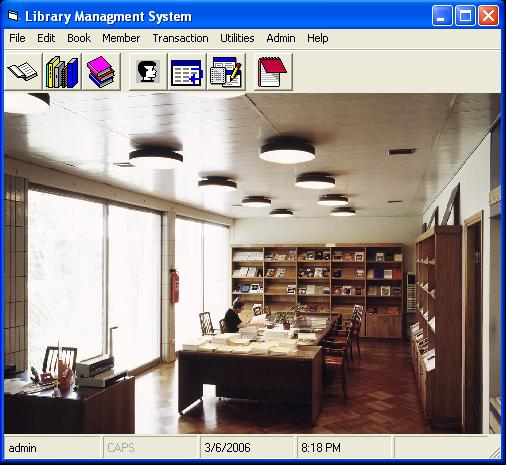



## Library Managment System

### Description

This is a well made system for computrisatio of library releated activites
 
### More Info
 
just open project . the default username is admin and password is also admin

             |
---                |---
**Submitted On**   |2006-03-06 20:31:04
**By**             |[Ravinder Singh Gulair](https://github.com/Planet-Source-Code/PSCIndex/blob/master/ByAuthor/ravinder-singh-gulair.md)
**Level**          |Beginner
**User Rating**    |5.0 (10 globes from 2 users)
**Compatibility**  |VB 5\.0, VB 6\.0
**Category**       |[Databases/ Data Access/ DAO/ ADO](https://github.com/Planet-Source-Code/PSCIndex/blob/master/ByCategory/databases-data-access-dao-ado__1-6.md)
**World**          |[Visual Basic](https://github.com/Planet-Source-Code/PSCIndex/blob/master/ByWorld/visual-basic.md)
**Archive File**   |[Library\_Ma197881382006\.zip](https://github.com/Planet-Source-Code/ravinder-singh-gulair-library-managment-system__1-64585/archive/master.zip)

